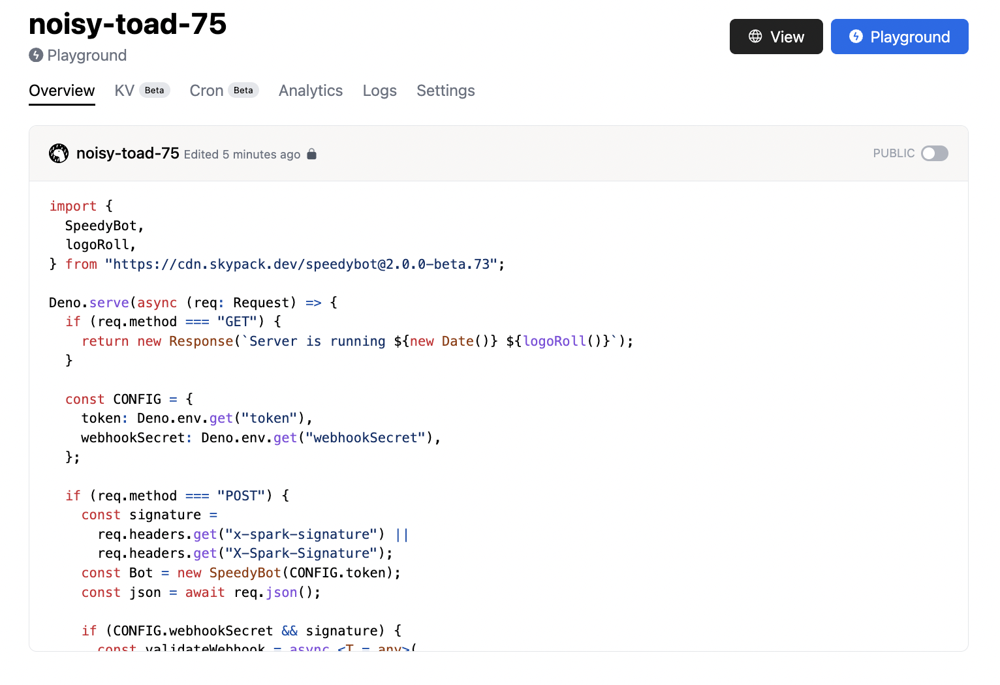

# [QUICKSTART] 🦖 Deploy your bot to Deno

Note: The steps below assume you have a **[working WebEx account](https://developer.webex.com/signup)** & a **[Deno Deploy account](https://deno.com/deploy/)**

## 1) Get your bot access token

- If you have an existing bot, get its token here: **[https://developer.webex.com/my-apps](https://developer.webex.com/my-apps)**

- If you don't have a bot, create one and save the token from here: **[https://developer.webex.com/my-apps/new/bot](https://developer.webex.com/my-apps/new/bot)**

- Write down your bot's access token, you'll need it in a minute

## 2) Create a new Project in Deno

- If you don't have one, sign up for a **[deno deploy account](https://deno.com/deploy)**

- Press the blue "New Playground" button


Note: There are many (better) ways to setup Deno, but for now we can just use the Playground and copy/paste everything in the panel below:

## 2a) Copy the code below into the playground

<details><summary>💡 Tap here to open code (copy me)</summary>

```ts
import { SpeedyBot, logoRoll } from "https://cdn.skypack.dev/speedybot@latest";

Deno.serve(async (req: Request) => {
  if (req.method === "GET") {
    return new Response(`Server is running ${new Date()} ${logoRoll()}`);
  }

  const CONFIG = {
    token: Deno.env.get("token"),
    webhookSecret: Deno.env.get("webhookSecret"),
  };

  if (req.method === "POST") {
    const signature =
      req.headers.get("x-spark-signature") ||
      req.headers.get("X-Spark-Signature");
    const Bot = new SpeedyBot(CONFIG.token);
    const json = await req.json();

    if (signature) {
      const validateWebhook = async <T = any>(
        requestData: T,
        secret: string,
        signature: string
      ): Promise<boolean> => {
        const stringyBody =
          typeof requestData !== "string"
            ? JSON.stringify(requestData)
            : requestData;
        const algo = {
          name: "HMAC",
          hash: "SHA-1",
        };
        const enc = {
          name: "UTF-8",
        };
        const hmacKey = await crypto.subtle.importKey(
          "raw",
          new TextEncoder().encode(secret),
          algo,
          false,
          ["sign"]
        );
        const hmacData = await crypto.subtle.sign(
          algo,
          hmacKey,
          new TextEncoder().encode(stringyBody)
        );

        const bufferToHex = (buffer: ArrayBufferLike) => {
          return Array.prototype.map
            .call(new Uint8Array(buffer), (x) =>
              ("00" + x.toString(16)).slice(-2)
            )
            .join("");
        };
        const hmacDataHex = bufferToHex(hmacData);
        return hmacDataHex === signature;
      };
      const proceed = await validateWebhook(
        json,
        CONFIG.webhookSecret,
        signature
      );
      if (proceed === false) {
        return new Response("Webhook Secret Rejected");
      }
    }

    Bot.exact("$clear", async ($) => {
      await $.clearScreen();
      return $.end;
    });

    Bot.addStep(async ($) => {
      if ($.data && !$.data.showCard) {
        const dataSnippet = $.buildDataSnippet($.data);
        await $.send(`This data was submitted:`);
        await $.send(dataSnippet);
        return $.end;
      } else {
        return $.next;
      }
    });

    Bot.addStep(async ($) => {
      await $.send(`helllllooo, you said "${$.text}"`);
      const card = $.card().survey([
        {
          type: "text",
          question: "What is the name of your company?",
          id: "company_name",
        },
        {
          type: "text",
          question: "Describe the service performed by the vendor.",
          id: "service_type",
        },
        {
          type: "picker-date",
          question: "When was the service provided?",
          id: "service_date",
        },
        {
          type: "single-select",
          question: "How would you rate the quality of service?",
          choices: ["Excellent", "Good", "Average", "Poor", "Very poor"],
          id: "service_quality",
        },
        {
          type: "multi-select",
          question: "What were the highlights of the service?",
          choices: [
            "Communication",
            "Punctuality",
            "Time to Resolution",
            "Friendliness",
            "Cost",
          ],
          id: "service_highlights",
        },
        {
          type: "single-select",
          question:
            "Would you consider using our services again in the future?",
          choices: [
            "Definitely",
            "Probably",
            "Not sure",
            "Probably not",
            "Definitely not",
          ],
          id: "future_use",
        },
        {
          type: "textarea",
          question:
            "Please provide any other comments or suggestions for improvement.",
          id: "other_comments",
        },
        {
          type: "picker-time",
          question: "What time of day is preferable for future contact?",
          id: "preferred_contact_time",
        },
        {
          type: "picker-dropdown",
          question: "Preferred method of communication for future updates?",
          choices: ["Email", "Phone", "Text"],
          id: "communication_method",
        },
      ]);

      await $.send(card);

      return $.next;
    });

    Bot.captureError(async (payload) => {
      const { roomId } = payload;
      if (roomId) {
        await Bot.sendTo(
          roomId,
          `Whoops, there was a problem: ${payload.message}`
        );
      }
    });

    await Bot.runMiddleware(json);
  }
  return new Response(`Request processed`); // webhooks should return **something**
});
```

</details>



## 3) Expose your bot access token to Deno

- You could insert your bot token directly in the Playground but a safer way is to use Deno environmental variables

- Inside your playground, tap the Settings button and add your `token` secret (the Bot token from step 1)

- If you're using a webhook secret (which you should), add it as a secret `webhookSecret`


Verify you hit save underneath each secret you add to the playground


## 4) Register your webhook

- Right now if you try to interact with your "deployed" agent nothing happens, nobody is "home" to answer the knock at the door

- Grab your playground's URL (it'll likely be a strange/random name like https://noisy-bongodrum-75.deno.dev) and register your webhook using SpeedyBot Garage

- Hop on over to the **[SpeedyBot Garage (https://speedybot.js.org/garage)](https://speedybot.js.org/garage)**, enter your access token, select the Webhooks tab, and then **Add New Webhook** and add your Worker's URL and (optionally but hopefully) a webhook secret


## 5) Take it for a spin

After connecting webhooks, send your bot a message to take it for a spin


<script setup>
import { useData } from 'vitepress'
import { useCustomStore } from "./../../.vitepress/util/store";
const { isDark } = useData()
const store = useCustomStore()
</script>
