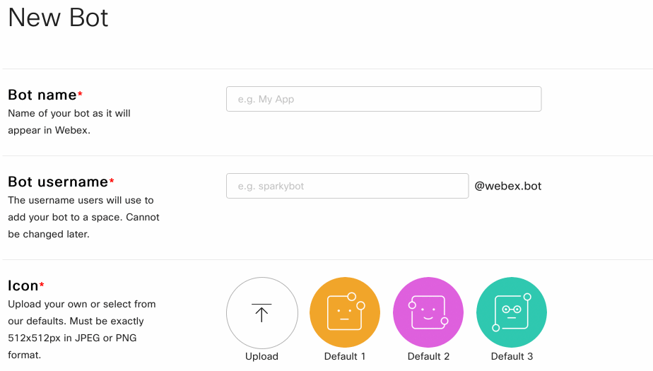
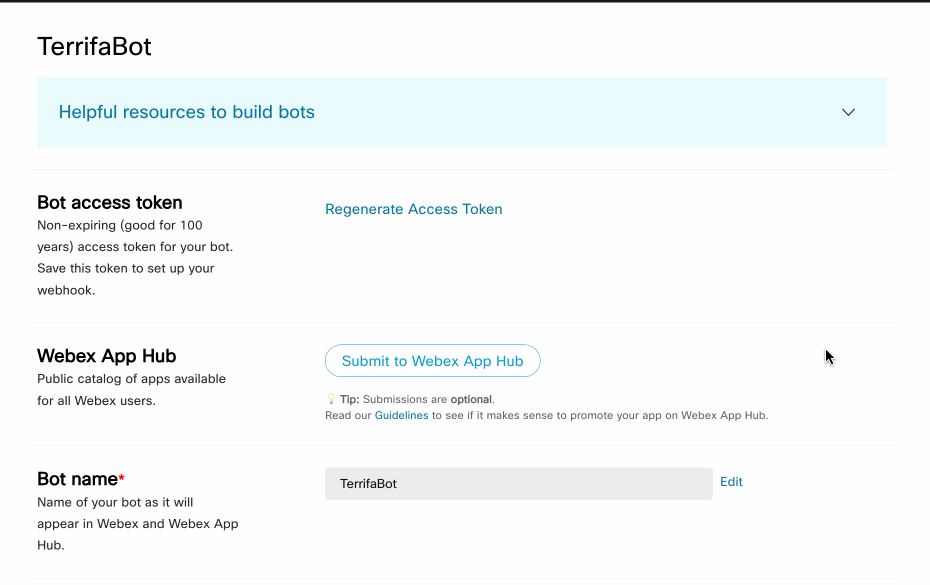
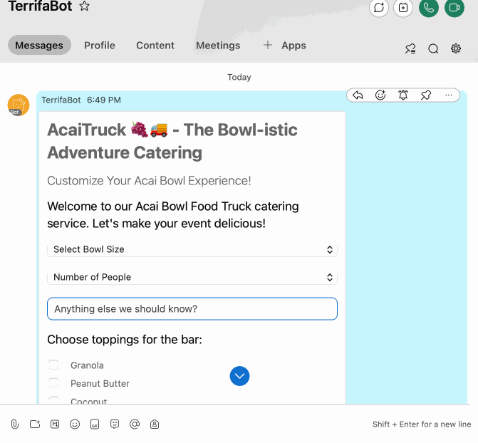

# "I'm new here" 🐣

Before all that though, let's keep things straightforward with a quick 3-step setup:

## Step I: Acquiring Your Access Token

- You'll need a WebEx account to build bots— if you don't have one one, sign up for a new account **[here](https://signup.webex.com/sign-up)**

- Once you have an account, create a new bot and copy its access token from here: **[https://developer.webex.com/my-apps/new/bot](https://developer.webex.com/my-apps/new/bot)**

The flow to get a token will look roughly like this:



### Validate Token

Once you've got your token, pop it into the box below to validate it & review your bot's details

<TokenInput :showInfo="true" :autofocus="false"/>

::: details Is this safe??

Your bot token is a **highly** sensitive credential and should be protected with encryption and proper secrets management.

SpeedyBot does **NOT** log/persist or do anything (except what you tell it to do) with your bot token.

**REMEMBER:** If your agent's access token is ever compromised/exposed, you can always invalidate it + get a new one by tapping "Regenerate Access Token" under your agent's <a href="https://developer.webex.com/my-apps" style="color:#646cff;text-decoration: bold;">settings page</a>



:::

## Step II: Send a Test Message with Your Access Token

- Let's test out your bot access token by sending a **[SpeedyCard](#im-new-here-🐣)** to you as a direct message (tap the 🎲 to shuffle through some examples)

  <SpeedyCardEditor></SpeedyCardEditor>

- When you're ready, tap the **Send Message** tab and use the email you signed up with as the destination and hit Send-- in about a second you should receive a new message from your bot

## Step III: Setup your bot listener

<el-alert
    title="⛔️ Nobody is listening"
    type="error"
    description="You may have noticed that if you tried to submit any data back from a card-- nothing happens "
  />



- In fact, any user interaction with {{ store.state.userData?.emails[0] ?? 'your bot'}} right now— be it a message, SpeedyCard submission, or file upload, results in icy radio silence

- That's because there's nobody "home"-- what we'll do now is setup a "listener" so anytime someone messages your bot it will respond back automatically per your instructions

## Run your bot from your computer

- You need SpeedyBot to "listen" for incoming messages (card, text, file, whatever) and to do that you'll need to turn on

- To keep things simple to start, we'll run the bot from your machine (ie when your computer is off your bot is off) but later if you need to, you can deploy it to virtually **[any standard server-ful or scalable serverless cloud infrastructure you want](#im-new-here-🐣d)**

Copy the commands below.

::: code-group

```sh-vue [🥺 New (recommended)]
npm init speedybot {{ store.state.tokenValid ? store.state.token : 'setup --project default' }}
```

```sh-vue [👹 Experienced]
git clone https://github.com/valgaze/speedybot-local-server
cd speedybot-local-server
npm i
npm run bot:setup {{ store.state.tokenValid ? store.state.token : '__ACCESS__TOKEN__HERE__' }} // this will create .env
```

:::

::: details Getting errors?

If you see an error like `npm: command not found` you probably need to install node or compatible runtime (like **[bun](https://bun.sh)** or **[deno](https://deno.com)**) onto your system.

There are many ways to do this, but two easy ways:

Option 1. Download + install Node from the official site: **[https://nodejs.org/en/download](https://nodejs.org/en/download)**

Option 2. Download with **[Volta](https://docs.volta.sh/guide/)** in the terminal

```sh
curl https://get.volta.sh | bash

volta install node
```

However you set up your system, make sure to run `node -v` in your terminal to verify node is correctly installed and you can take advantage of its rich ecoysten

:::

If all went well, you should see something like this in your terminal:

Now send a message to your bot and you'll see a welcome screen with buttons and cards


You can customize this however you want by editing the file **[settings/bot.ts](https://github.com/valgaze/speedybot-starter/blob/deploy/settings/bot.ts)**

Turn off your bot by tapping CTRL-C, to

Follow the steps below to run a listener on your local machine

::: details Sending Adaptive Cards: Personal Access Token

Did you know there's a nifty way to send adaptive cards using a your own accont instead of your bot's?

Check out the process here: <a href="https://developer.webex.com/docs/getting-your-personal-access-token" style="color:#646cff;text-decoration: bold;">https://developer.webex.com/docs/getting-your-personal-access-token</a>

Heads up-- unlike your bot token we're using right now, a personal access token will self-destruct after 12 hours

:::

Follow the instructions in new.md to obtain your access token.
Use the token to send yourself a SpeedyCard.
Step II: Setting Up Your Bot

Head over to new2.md and configure your own bot.
Watch it spring to life, responding dynamically to user interactions.

It doesn't matter if you're a rookie who's never written a line of code before or a seasoned pro just looking to build bots rather than just read docs, the quickstart guide below should get you squared away with everything you need.

To keep things simple, setup is broken up into two steps:

## Step 1: Get your bot's token

- You'll need a WebEx account to build bots—— if you don't have one one, sign up for a new account **[here](https://signup.webex.com/sign-up)**

- Create a new bot and copy its access token from here: **[https://developer.webex.com/my-apps/new/bot](https://developer.webex.com/my-apps/new/bot)**


## Step 2: Validate your bot's token

Once you have a token, you can validate it below:


<TokenInput :showInfo="true" :autofocus="false"/>

::: details Is this safe??

Your bot token is a **highly** sensitive credential and should be protected with encryption and proper secrets management.

SpeedyBot does **NOT** log/persist or do anything (except what you intstruct it to do) with your bot token.

**REMEMBER:** If your agent's access token is ever compromised/exposed, you can always invalidate it + get a new one tapping "Regenerate Access Token" under the **[settings page](https://developer.webex.com/my-apps)**

:::

<Blur :shouldBlur="!store.state.tokenValid">

## Step 3: Send a test message

<SendMsg :autofocus="false" />
Enter your account's name and send yourself a test message

</Blur>

Tip: we sent the message as your bot to you.

## Step 1: Get your bot's token

If you don't have a bot token, go ahead and **[make one here 🔗](https://developer.webex.com/my-apps/new/bot)** But you need to be logged in blah blah blah

Once you have token, you can validate it below:

::: tip
WHERE CAN AI.JSX RUN?

SpeedyBot can run in serverless/edge functions, Bun/Deno/Vercel/ fixed server, anywhere you can run
:::

## Step 1: Get your bot's token

If you don't have a bot token, go ahead and **[make one here 🔗](https://developer.webex.com/my-apps/new/bot)** But you need to be logged in blah blah blah

Once you have token, you can validate it below:

If you follow these instructions exactly you **should** have a working WebEx bot

<div v-if="type === 2">

## 1) Clone repo & install dependencies

```
git clone https://github.com/valgaze/speedybot-voiceflow
cd speedybot-voiceflow
npm install
```

</div>

Step 0

Get a token (you'll need this to make a bot)

Step 1: Get Bun for your system

```sh
curl -fsSL https://bun.sh/install | bash
```

<div v-if="type === 1">
Step 2: Get the code and load your token

```sh
bunx create-speedybot@latest --token=__PUT__YOUR__TOKEN__HERE
```

</div>

<div v-if="type === 2">
Step 2: Get the code and load your token

```sh
git clone https://github.com/valgaze/speedybot-starter speedybot-starter
cd $_
bun install
bun run bot:token __PUT__YOUR__TOKEN__HERE
```

</div>

Step 3: Turn on your bot

```
bun run bot:on
```

Step 4: Ask questions

Step 5: Turn your bot "off" with CTRL-C

You

```
bunx create-speedybot init --project=default --token=**REPLACE**WITH\_\_TOKEN --start=yes
```

<script setup>
import { ref, watch } from 'vue'
import { useData } from 'vitepress'
import { useCustomStore } from "./.vitepress/util/store";
import TokenInput from './.vitepress/components/token_handler.vue'
import Blur from './.vitepress/components/Blur.vue'
import SendMsg from './.vitepress/components/SendMsg.vue'
import SpeedyCardEditor from './.vitepress/components/SpeedyCardEditor.vue'

const { isDark } = useData()
const store = useCustomStore()

const currentStep = ref(0)
const type = ref(1)

</script>
